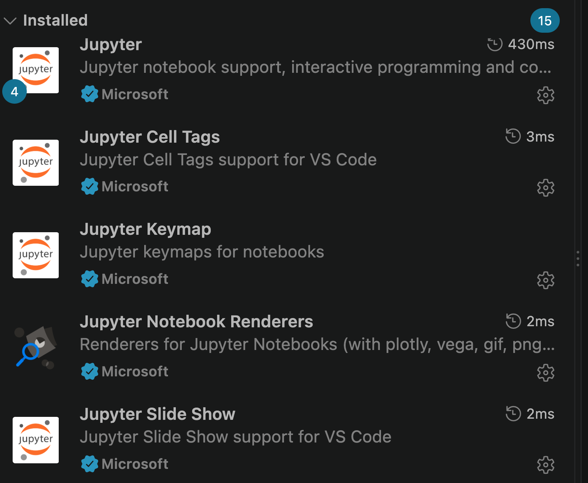
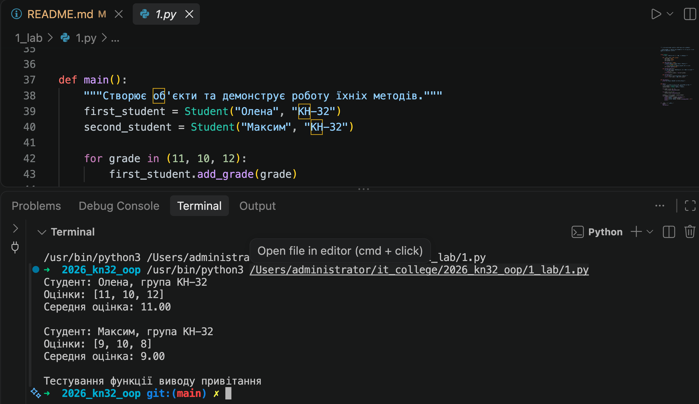
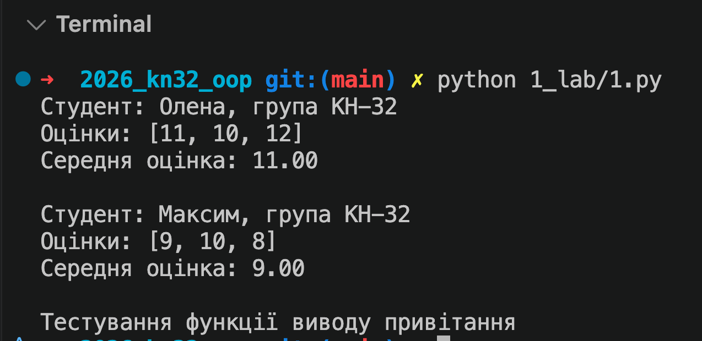
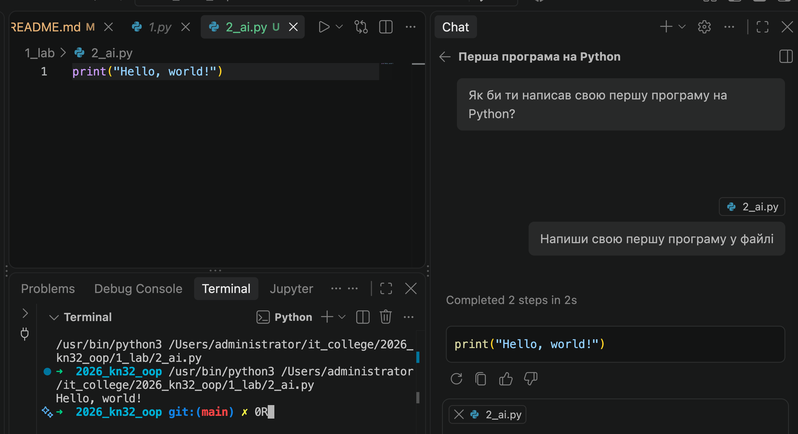

# Звіт до роботи
## Тема: _Оформлення та здача робіт, перша програма на Python_
### Мета роботи: _налаштувати середовище роботи у VS Code, створити репозиторій GitHub та налаштувати інтеграцію з ним, написати першу програму на Python і створити звіт із використанням форматування Markdown._

---
### Виконання роботи
* Результати виконання роботи та індивідуальних завдань:
    1. Створили репозиторій на GitHub та налаштували інтеграцію з VS Code (доставили потрібні плагіни). Результат представлений на скріншоті нижче.
         
    1. Створили файли `README.md`, `1.py` та `1.ipynb` у репозиторії. Написали першу програму на Python, яка виводить на екран текст з оцінками студентів. Навчились запускати прогаму декількома способами: через термінал, через інтегровану консоль VS Code та через Jupyter Notebook. Результат представлений на скріншоті нижче.
        
        
    1. Попрацювали у Jupyter Notebook. Всі приклади виконання роботи представлені у [файлі `1.ipynb`](./1.ipynb):
        1. Використали комірки для навчання форматування Markdown та вставки коду.
        1. Виконали кодові приклади на Python.
        1. Зробили індивідуальні завдання.
    1. Попрацювали з Copilot, напсали промпт та отримали наступні результати:
        
    1. Навчились робити висновок по зробленій роботі: заповнювати звіт, побачили що неправильні запити до АІ дають неправильні результати, як вставляти посилання на файли, як робити скріншоти та вставляти у звіт, навчились спрощувати роботу прогамами, запускати код різними способами, планувати роботу програм, та повність оформляти звіт з шаблону.

---
### Висновок:
> у висновку потрібно відповісти на запитання:

- :question: Що зроблено в роботі: Створено репозиторій на GitHub, налаштовано інтеграцію з VS Code, написано першу програму на Python, виконано завдання у Jupyter Notebook, спробовано використання Copilot.
- :question: Чи досягнуто мети роботи: Так, мета роботи досягнута.
- :question: Які нові знання отримано: Навчилися працювати з GitHub, VS Code та Jupyter Notebook, а також використовувати Copilot для створення коду.
- :question: Чи вдалось відповісти на всі питання задані в ході роботи: Так, всі питання були розглянуті та відповіді надані.
- :question: Чи вдалося виконати всі завдання: Так, всі завдання були виконані.
- :question: Чи виникли складності у виконанні завдання: Так, невдалось зареєстуватись на Github Education.
- :question: Чи подобається такий формат здачі роботи (Feedback): Так, формат здачі роботи відповідає очікуваним стандартам.
- :question: Побажання для покращення (Suggestions): Можливо, додати більше прикладів використання Copilot та інтеграції з іншими інструментами для покращення ефективності роботи.

---
